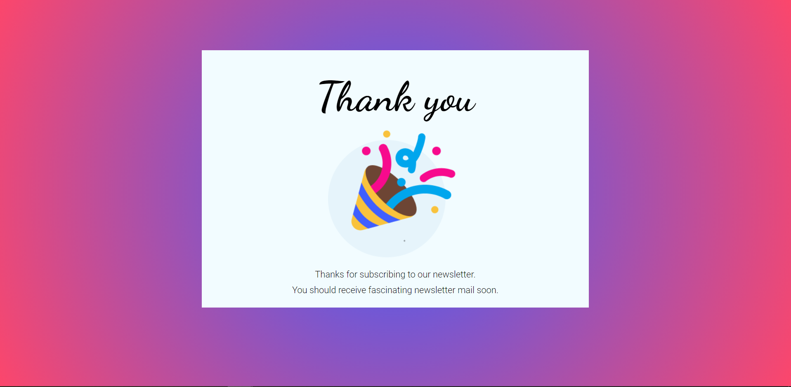
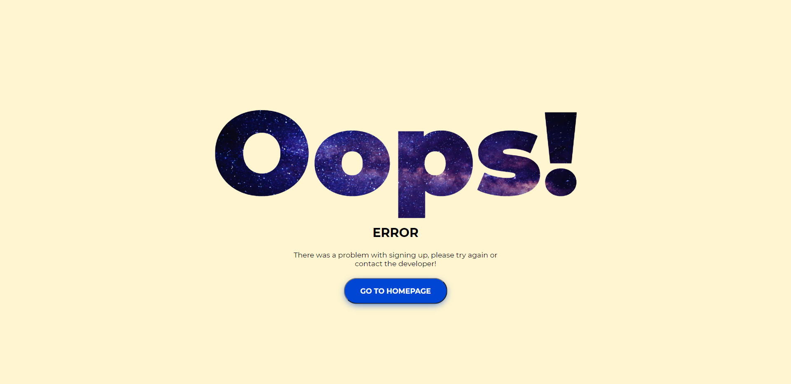
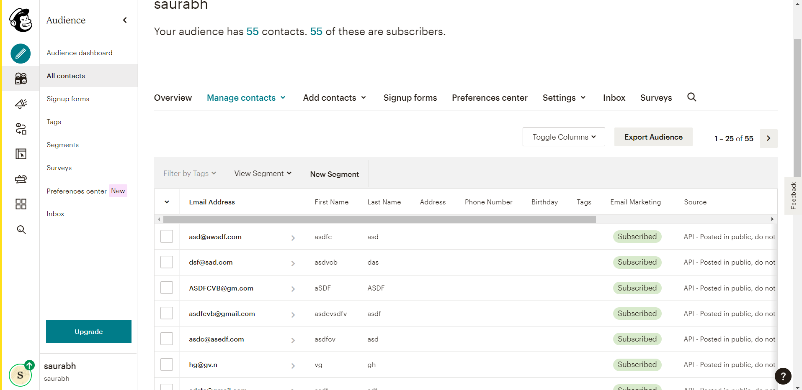

# Newsletter Signup

*  This is a NewsLetter website made by using Node, Express, Mailchimp API, Heroku.
*  When a user signup for newsletter it stores data inside database, Which can be used in future to to give update to all the users.
*  If details are added successfullt a succes page will be shown.
*  If some error occurs during storing user's data into database, than it will show failure page.

## Tech Stack

* **Technology:** Express.js, Node.js, Mailchimp API, Heroku

  
## Link

[Heroku](https://bearded-celsius-50101.herokuapp.com)

## Demo

 

 

 

  
## Authors

- [@s0sharma](https://github.com/s0sharma)

  
